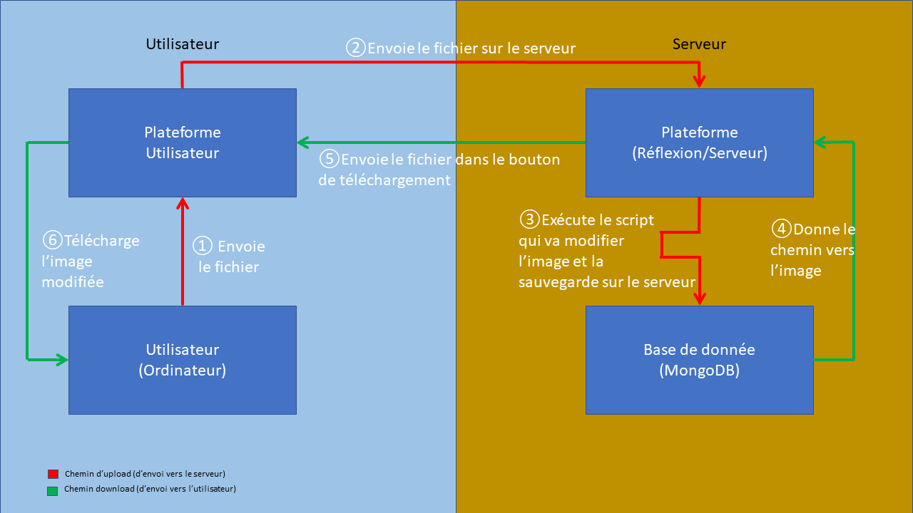
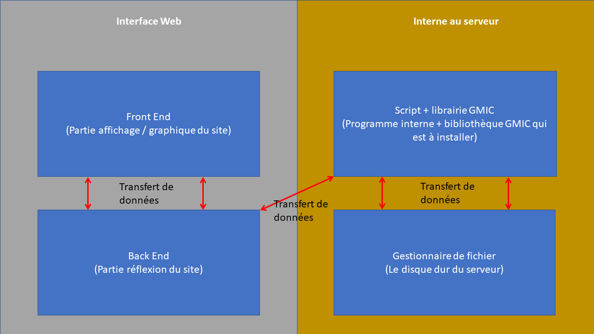

# Focus+ Prototype

Outil d'évaluation en ligne du niveau d'accessibilité des documents administratifs quels que soient leurs formats, proposant l'accompagnement nécessaire pour que l'utilisateur puisse améliorer sa production.

## Intrapreneur
Erwan Le Gall (novembre 2019 - octobre 2020)

Logo de Focus+ imaginé et disigné par Erwan Le Gall
[Son GitHub](https://github.com/ele-gall-ac-mineducation/focusplus_assets/blob/master/focusplus%20-%20logo%20et%20texte.svg)

## Détails du projet

Focus+ sera constitué (pour l'instant) de 3 parties, chacune reliée avec une page d'accueil.

(Pour rappel l'accessibilité est le fait de rendre quelque chose accessible pour des personnes atteinte d'un handicap)

La Première partie : L'évaluation / Conversion d'un document en document accessible

C'est le coeur du projet, cette partie consite a récupérer un document puis juger si ce document est accesible ou non, et l'indiquer à l'utilisateur (voir de le modifier si besoin)
    
La Deuxième partie : Vidéos sur l'accesiblité
C'est une partie un peu similaire a Youtube, ou il y aurait des vidéos sur l'accesiblité ou comment rendre certains documents accessibles (des tutoriels)
    
La Troisième partie : Forum autour de l'accessibilité

Un petit forum où les utilisateurs pourront partager leurs expériences sur l'accessibilité

## Détails Technique du projet

Ce projet suit la technologie fullstack MERN (MongoDB Express React Node).
Le serveur sera hébergé plus tard sur un serveur du ministère, il faudra potentielement changer la partie MongoDB, mais dans le cadre de notre prototype, nous utiliserons cette base de données gratuite.

Cette base de données est facilement modifiable. (Et est pour l'instant sous un compte de Quentin Treheux).

Extensions utilisées

* Pour le Front
       - axios (Requête HTTP) 
       - bootstrap (Framework de CSS) 
       - downloadjs (Gère le download)
       - node-sass
       - react-bootstrap
       - react-dropzone (permet d'avoir notre drag and drop facilement)
       - react-router-dom (permet de naviguer entre les différentes pages facilement)    
* Pour le Back
       - mongoose (Connection avec la base de données MongoDB)
       - mongoose-unique-validator
       - jswebtoken
       - body-parser
       - cors
       - multer (Sauvergarde sur le serveur les fichiers uploader)
       - express (Partie Middleware)
       - child_process (Permet d'éxécuter un script)

La lib G'MiC à été réaliser par l'université de Caen [Site de G'MIC](https://gmic.eu)  
Le script.sh ("gmic.sh" dans le dossier backend) s'utilise avec la lib de gmic (installateur (.rpm) dans le dossier Install_Gmic).  
Le prototype ayant été fait sous fedora il est possible que le .rpm ne soit pas utilisable pour votre système d'exploitation, voici un lien si besoin : [Installer Gmic](https://gmic.eu/download.html)

Le script.sh "run.sh" permet de lancer le site automatiquement (lance le backend en tache de fond sur le port 5000 puis le frontend sur le port 3000).
Les scripts ne peuvent être utilisés que si bash est installé (à vérifier sur les serveurs du ministère, sinon modification éventuelle à prévoir)

Voici un petit schéma explicatif du fonctionnement de la première partie :

Dans le cadre de notre prototype nous appliquons seulement un filtre de daltonisme (3 versions) sur l'image puis nous la renvoyont à l'utilisateur

## A faire :
Fix quelques problèmes (évoquer au dessus).
Rendre le site accessible.
Sécurisé le site de divers attaques (cyber sécurité).
Faire les deux autres parties :

- Partie vidéo (un peu comme youtube)
- Partie forum (un peu comme jeuxvideo.com)
- Renforcer la 1er partie avec du machine learning

## Utilisation

Pour lancher le script "run.sh" utiliser la commande : `./run.sh` cela lancera le backend en tâche de fond puis le frontend.

## Détails

Ceci est un propotype de Focus+ (réalisé par deux stagiaires d'Epitech)  
Nous avons utilisé les languages suivants : React.js + Express.js + Node.js  
Pour la base de données on utilisera : MongoDB (a changer si besoin pour les serveurs du ministère)  
Comme nous utilisons ces outils on utilise donc la techno fullstack appeler MERN  
La partie REACT.js se trouve dans le dossier "src"  
Les parties EXPRESS.js et NODE.js elle se trouve dans le dossier "backend"  
Le front utilise le port 3000 et le back le port 5000 (les ports sont bien sûr modifiables).

Pour la partie Vidéo, les vidéos devront être hébergées sur le PeerTube du Lab110 Bis

## Points Historiques :
Nous avons eu quelques problèmes durant la conception de ce prototype.
ATTENTION AU RESEAU DU MINISTERE QUI BLOQUE CERTAINES CHOSES CAR CERTAINS PORTS OU ADDRESSES SONT BLOQUEES PAR UN FIREWALL !!!

- Tout d'abord le choix du langage :
Nous voulions utiliser à la base du REACT + C# mais les serveurs du ministère sont sous linux, C# étant plus orienté Windows nous avons finalement décidé d'utiliser le Node.js.
De plus nous utilisons ces langages du fait de leur performances ainsi que leur popularité et leur souplesse.

- Le MERN :
Comme nous ne connaissont pas le JS et donc le REACT / EXPRESS / NODE il est possible que notre code ne soit pas très optimisé ou qu'il y ai des manières plus simple de faire ce qu'on a fait (après rien n'empêche de faire cela différement, après tout un code peut etre fait de plusieurs façons). Mais on essaye d'être le plus clair possible.
Mais nous ne connaissions pas non plus le MERN et donc avons dû appliquer cette techno fullstack car elle nous semblait la plus adapté. (Au départ, on essyait de connecter le front et le back sans y arriver car nous ne connaissions pas le MERN et donc pas de dépendances pour cela).

- Problème pour sauvegarder des fichiers :
Au départ, nous avions des soucis car on faisait mal nos requête HTTP, puis on ne savait pas comment sauvegarder le document récupéré dans le Drag & Drop sur le serveur.
Finalement nous avons trouver la dépendance MULTER qui nous permet de réaliser ceci.

- Problème d'incompatibilité :
Pour le drag & drop nous voulions utiliser la dépendance REACT appelée DropZone malheureusement celle-ci est incompatible avec Axios qui nous permet de réaliser facilement des requêtes HTTP.
Du coup, nous avons nous même fait un Drag & Drop.

- Problème pour récupérer les fichiers :
Nous avons eu aussi un problème pour récupérer les fichiers générés par le script.sh (gmic.sh), lorsque l'on faisait le download, on ne récuperait qu'un .html.
Après plusieurs recherches nous avons découvert que, pour que le REACT trouve les fichiers il faut les placer dans le dossier "public".

- NOUVELLE VERSION :
L'ancienne version est disponible dans le dossier Archive, nous avons décider de faire une toute nouvelle version du prototype car l'ancienne version ne pouvait pas utiliser bootstrap (qui optimise le site) de plus cela nous a permis de faire une interface plus simple et plus ergonomique et avec beaucoup moins de bug

- A11Y :
Nous avons essayé de rendre accessible notre plateforme Web malheureusement sans y arriver pour l'instant.
Regardez React a11y, bootstrap a11y et css a11y.

- MongoDB :
MongoDB nous cause des problèmes car pour l'instant seulement Quentin arrive à l'utiliser avec le programme malgré la désactivation du filtre d'adresse IP.

- Déploiement du site :
Nous ne pouvons actuellement déployer que la partie Front du site, simplement parce que notre backend est constiué de 3 parties et deux d'entre elles sont du Bash et une Lib GMIC, ce qui rend difficile l'hébergement de ce dernier sans utiliser un de nos serveurs (en cours de réflexion).

 - Utilisateur :
 Nous avons rencotrés des problèmes avec une route pour créer nos utilisateur. Cela est finalement régler avec la lib "body-parser".

 - Cyber sécurité :
 Nous avons essayer de mettre la librairie de hashache "bcrypt" mais nous avons pas réussi à la faire fonctionner. Point à traiter.

## Nos idées

Voici une petite liste de nos idées concernant la suite du projet :
- Utiliser Python pour le machine learning afin de compléter la partie 1
- Renforcer la cyber sécurité du site

Pour toutes nouvelles idées voir avec l'intraprenneur du projet
